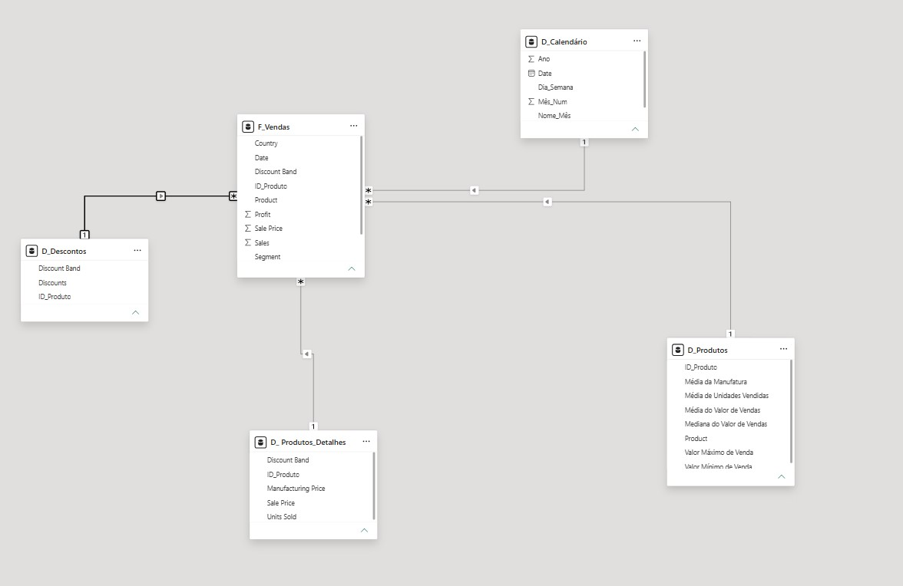

# 📊 Construção de Modelo Star Schema no Power BI com Financial Sample

> **Projeto prático de Modelagem Dimensional e ETL desenvolvido para o desafio da [DIO (Digital Innovation One)](https://dio.me).**

---

## 🎯 Objetivo do Projeto
O objetivo deste projeto foi transformar uma base de dados única e desnormalizada (*flat table*) chamada **Financial Sample** em um **modelo dimensional em estrela (Star Schema)** profissional, otimizando a estrutura de dados para análise de vendas, produtos e performance temporal.

---

## 🛠️ Etapas do Processo de ETL (Power Query)

### 1. Backup e Estruturação das Tabelas
* **`financials_origem`**: Cópia oculta da tabela original para servir como backup e ponto de restauração.
* **`F_Vendas`**: Tabela Fato contendo a granularidade das transações de vendas, com a adição de uma chave substituta (*Surrogate Key*) `SK_ID`.

### 2. Criação da Chave Condicional
* Adição da coluna condicional `ID_Produto` atribuindo identificadores numéricos únicos para cada produto (*Carretera = 0, Montana = 1, Paseo = 2, Velo = 3, VTT = 4, Amarilla = 5*).

### 3. Construção das Tabelas Dimensão (Agrupamento e Limpeza)
* **`D_Produtos`**: Tabela criada utilizando a funcionalidade **Agrupar Por (Group By)** para calcular estatísticas agregadas por produto (Média de unidades vendidas, valores mínimos, máximos e medianas de venda e manufatura).
* **`D_Produtos_Detalhes`**: Tabela contendo atributos detalhados dos produtos e preços, tratada com remoção de duplicadas para garantir granularidade de dimensão.
* **`D_Descontos`**: Tabela contendo a relação de faixas de desconto (*Discount Band*) e valores de desconto, tratada com a remoção de duplicadas.

---

## 📅 Criação da Tabela `D_Calendário` via DAX

Para permitir análises temporais ricas (por Ano, Mês, Trimestre e Dia da Semana), a tabela de dimensão de datas foi criada utilizando a seguinte instrução em **DAX**:

```dax
D_Calendário = 
ADDCOLUMNS(
    CALENDAR(MIN(F_Vendas[Date]), MAX(F_Vendas[Date])),
    "Ano", YEAR([Date]),
    "Mês_Num", MONTH([Date]),
    "Nome_Mês", FORMAT([Date], "mmmm"),
    "Trimestre", "Q" & INT((MONTH([Date]) + 2) / 3),
    "Dia_Semana", FORMAT([Date], "dddd")
)

🌟 Estrutura do Modelo Star Schema

O modelo final foi conectado na exibição de modelo do Power BI com a F_Vendas no centro e as dimensões conectadas em relacionamentos 1 para Muitos (1:N):

🔗 D_Calendário[Date] (1) ➡️ F_Vendas[Date] (N)
🔗 D_Produtos[ID_Produto] (1) ➡️ F_Vendas[ID_Produto] (N)
🔗 D_Descontos[Discount Band] (1) ➡️ F_Vendas[Discount Band] (N)
🔗 D_Produtos_Detalhes[ID_Produto] (1) ➡️ F_Vendas[ID_Produto] (N)

🖼️ Resultado Visual do Modelo





🛠️ Tecnologias e Ferramentas Utilizadas
Microsoft Power BI Desktop
Power Query Editor (Transformação e Limpeza de Dados)
Linguagem DAX (Criação de Tabelas e Inteligência de Tempo)
Git & GitHub (Versionamento e Portfólio)

Desenvolvido com 💙 durante a formação em Data Analytics na DIO.


